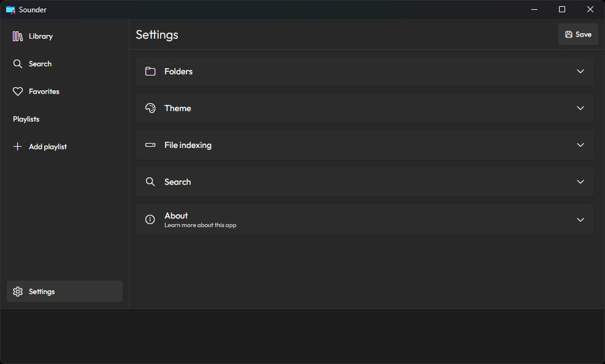

## Electron vite react




## Libraries

- React
- Emotion
- Framer-motion
- Vite
- Electron
- RxJS
- Lodash
- React-router-dom
- Uuid

## Running this project

1. Install all dependencies.

```sh
pnpm i
```

2. Start vite development server.

```sh
pnpm dev
```

## Building the project

```sh
pnpm build
```
